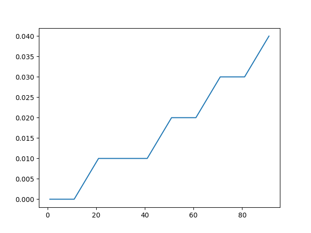

# Pingmb

## Herramientas

## Procedimiento
> 1) Intercambio de llaves entre el servidor web (10.99.1.138) y el de almacenamiento (192.168.0.200)
> 2) Copiar el archivo al directorio publico de su cuenta en el servidor web.
> 3) Utilizar wget y scp para la bajada y subida de datos.
> 4) Subirlo todo al github.
> 5) 1Mb = 1024x1024 bytes.

## Resultados
- 1 MBs => 0.00 s
- 11 MBs => 0.00 s
- 21 MBs => 0.01 s
- 31 MBs => 0.01 s
- 41 MBs => 0.01 s
- 51 MBs => 0.02 s
- 61 MBs => 0.02 s
- 71 MBs => 0.03 s
- 81 MBs => 0.03 s
- 91 MBs => 0.04 s

## Gráfica

